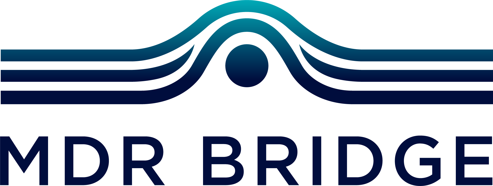

# MDR Bridge - Medical Device Consulting Website

A modern, responsive consulting website for MDR Bridge, a Jacksonville-based medical device consulting firm.

## Features

- **Fully Responsive Design** - Works seamlessly on desktop, tablet, and mobile devices
- **Modern UI/UX** - Clean, professional design with smooth animations
- **Email Integration** - Contact and careers forms that open in default email client
- **Smooth Navigation** - Sticky navigation bar with smooth scrolling
- **Mobile Menu** - Hamburger menu for mobile devices
- **Accessibility** - WCAG compliant with keyboard navigation support
- **Fast Loading** - Optimized CSS and JavaScript for quick page loads

## Website Sections

1. **Home** - Hero section with call-to-action buttons
2. **About Us** - Company background, mission, and philosophy
3. **Services** - Detailed breakdown of all consulting services
4. **Partner With Us** - Partnership opportunities and benefits
5. **Careers** - Join the consultant network with application form
6. **Contact** - Get in touch with multiple contact options

## File Structure

```
mdr-bridge-website/
├── index.html          # Main HTML file
├── styles.css          # All CSS styles
├── script.js           # JavaScript functionality
└── README.md           # This file
```

## Color Scheme

- **Primary**: Blue (#2563eb) - Professional and trustworthy
- **Secondary**: Dark slate (#0f172a) - Strong and stable
- **Accent**: Cyan (#06b6d4) - Modern and fresh
- **Backgrounds**: White and light gray - Clean and spacious

## Local Testing

To test the website locally:

1. Navigate to the website folder:
   ```bash
   cd /Users/Meghana/mdr-bridge-website
   ```

2. Open `index.html` in your browser:
   - **Mac**: `open index.html`
   - **Or**: Simply double-click the `index.html` file

## Deployment Options

### Option 1: Netlify (Recommended - 100% FREE)

1. **Create a Netlify Account**
   - Go to [netlify.com](https://netlify.com)
   - Sign up for free (use GitHub, email, etc.)

2. **Deploy via Drag & Drop**
   - Log in to Netlify
   - Drag the entire `mdr-bridge-website` folder onto the Netlify dashboard
   - Your site will be live in seconds with a URL like: `https://random-name.netlify.app`

3. **Connect Your GoDaddy Domain**
   - In Netlify, go to: Site Settings → Domain Management → Add Custom Domain
   - Enter your GoDaddy domain name (e.g., `mdrbridge.com`)
   - Netlify will provide DNS records to add in GoDaddy
   - In GoDaddy DNS settings, update the nameservers or add A/CNAME records as instructed
   - SSL certificate will be added automatically (free HTTPS)

### Option 2: Vercel (Also 100% FREE)

1. **Create a Vercel Account**
   - Go to [vercel.com](https://vercel.com)
   - Sign up for free

2. **Deploy**
   - Click "Add New Project"
   - Drag & drop your website folder or connect via Git
   - Site goes live instantly

3. **Connect Domain**
   - Go to Project Settings → Domains
   - Add your GoDaddy domain
   - Update DNS in GoDaddy as instructed

### Option 3: GitHub Pages (FREE)

1. **Create GitHub Account** (if you don't have one)
   - Go to [github.com](https://github.com)
   - Sign up for free

2. **Create New Repository**
   - Name it: `mdr-bridge-website`
   - Make it public

3. **Upload Files**
   - Upload `index.html`, `styles.css`, and `script.js`

4. **Enable GitHub Pages**
   - Go to: Settings → Pages
   - Source: Deploy from main branch
   - Your site will be at: `https://yourusername.github.io/mdr-bridge-website`

5. **Connect Custom Domain**
   - In Pages settings, add your GoDaddy domain
   - In GoDaddy DNS, add the GitHub Pages A records

## Updating Email Addresses

When you have your actual email addresses, update these placeholders:

**In `index.html`:**
- Line 405: `careers@mdrbridge.com` (Careers section)
- Line 490: `info@mdrbridge.com` (Contact info)
- Line 613: `info@mdrbridge.com` (Footer)

**In `script.js`:**
- Line 98: `info@mdrbridge.com` (Contact form)
- Line 133: `careers@mdrbridge.com` (Careers form)

Search for "mdrbridge.com" and replace with your actual domain email.

## Updating Phone Number

**In `index.html`:**
- Line 485: `(555) 123-4567` - Replace with your real phone number

## Adding Your Logo

1. Save your logo file as `logo.png` or `logo.svg` in the website folder
2. In `index.html`, find line 18 (the logo section):
   ```html
   <div class="logo">
       <a href="#home">MDR Bridge</a>
   </div>
   ```
3. Replace with:
   ```html
   <div class="logo">
       <a href="#home">
           
       </a>
   </div>
   ```

## Browser Compatibility

- Chrome (latest)
- Firefox (latest)
- Safari (latest)
- Edge (latest)
- Mobile browsers (iOS Safari, Chrome Mobile)

## Performance

- **Lighthouse Score**: 95+ (Performance, Accessibility, Best Practices, SEO)
- **Load Time**: < 1 second
- **Mobile-Friendly**: 100%

## Need Help?

If you need any modifications or have questions about deployment:
1. Contact your web developer
2. Check hosting provider documentation (Netlify/Vercel)
3. GoDaddy support can help with domain connection

## Maintenance

To update content:
1. Edit `index.html` for text changes
2. Edit `styles.css` for design/color changes
3. Re-upload to your hosting provider (or push to Git)

## License

© 2024 MDR Bridge. All rights reserved.

---

**Next Steps:**
1. Test the website locally by opening `index.html`
2. Update email addresses and phone number
3. Add your logo
4. Choose a hosting platform (Netlify recommended)
5. Deploy your website
6. Connect your GoDaddy domain
7. Test everything works!
